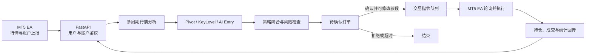

# AITrader

### 面向 MT5 的多用户 AI 交易决策与执行平台

AITrader 把 **MT5 行情接入、AI 多周期研判、可配置策略、风险控制、人工确认和交易执行** 串成一条完整链路。

每位用户拥有独立的配置、EA 绑定、交易引擎与运行状态，既适合个人研究，也为后续 SaaS 化提供了基础。

<p>
  
  
  
  
  
</p>

> [!IMPORTANT]
> 本项目用于技术研究、策略验证与个人学习，不构成任何投资建议。自动交易具有风险，请先在 MT5 模拟账户中充分测试。

## 为什么是 AITrader

传统 EA 通常把行情、策略和执行写在同一个脚本里，策略调整困难，也不便于引入 AI 或多人使用。AITrader 将这些能力拆分为独立服务：

- **轻量接入**：用户下载已编译的专属 `.ex5`，放入 MT5 指定目录即可激活，无需 MetaEditor 编译。
- **AI + 技术信号**：同时分析 H4、H1、M15、M5、M1，并融合 Pivot、KeyLevel 与 AI Entry 信号。
- **人机协同**：策略命中后先生成待确认订单，用户可修改手数、止损和止盈，再决定是否发送给 MT5。
- **风险优先**：支持持仓上限、同向限制、风险回报比、单日风险、订单上限与亏损熔断。
- **多用户隔离**：登录用户拥有独立配置、账户绑定、指令队列、持仓统计和运行状态。
- **全链路可视化**：从行情与 AI 结论，到指令执行、当前持仓和历史统计，都可以在 Web 端查看。

## 产品界面

### AI 多周期趋势研判

系统按周期展示 AI 趋势、置信度、判断依据和技术指标结论，帮助用户快速理解不同级别的市场结构。


### 关键价位与交易建议

AI 分析结果可以输出方向、入场价、止损、止盈和判断理由，并与技术信号一起进入策略决策。


### 可配置的策略与风控

每个交易品种可以独立配置启用周期、信号权重、最低置信度、一致性要求、仓位和止盈止损规则。


### 人工确认后再执行

策略触发后生成待确认订单。用户可以核对信号来源，调整交易参数，然后确认发送或直接拒绝。


### 持仓与统计复盘

平台汇总当前持仓、方向、盈亏和交易数量，并支持按品种查看历史成交表现。


## 交易闭环



1. MT5 EA 上报多周期 K 线、账户信息、持仓和成交记录。
2. 后端完成 Pivot、关键价位、技术指标及 AI 趋势分析。
3. 策略服务按品种配置聚合信号，并执行仓位与风险检查。
4. 命中条件后生成待确认订单，默认保留 3 分钟。
5. 用户确认后，订单转换为绑定账户专属的交易指令。
6. EA 拉取指令并在 MT5 执行，结果回传平台用于监控和统计。

## MT5 EA 接入

新用户注册后会进入 MT5 接入引导页。平台基于一次性激活码生成专属文件名，用户不需要在文件中填写账号、Token 或其他凭证。


安装步骤：

1. 在“连接 MT5”页面下载 `mt5TerminalEA_<激活码>.ex5`。
2. 在 MT5 中选择“文件 → 打开数据文件夹”。
3. 将文件放入 `MQL5/Experts/AITrader/`。
4. 在 MT5 设置中允许 WebRequest，并将 EA 挂载到图表。
5. EA 首次通信时消费一次性激活码，自动绑定当前 Web 用户与 MT5 账户。

激活码默认 **10 分钟内有效且仅可使用一次**。已下载过 EA 的用户再次登录时会直接进入仪表盘。

## 多用户架构

```text
Vue 3 + Vuetify
        |
        | Bearer Token
        v
FastAPI API
        |
        +-- AuthManager                 用户注册、登录与会话
        +-- TradingAccountRepository    用户与 MT5 账户绑定
        +-- TradingEngineManager        按用户/账户创建隔离引擎
        +-- UserConfigRepository        LLM、交易与策略配置
        +-- RuntimeStateRepository      指令、持仓、统计与风控状态
        |
        v
SQLite
        ^
        |
mt5TerminalEA.ex5
```

当前多用户边界包括：

- 用户认证与 Token 会话
- MT5 账户及 EA 激活绑定
- 大模型、自动交易和品种策略配置
- 交易指令、待确认订单、持仓、成交与统计
- 每日风险占用、订单计数和亏损熔断状态

行情数据作为公共市场数据共享，不按用户重复存储。

## 技术栈

| 层级 | 技术 |
| --- | --- |
| 前端 | Vue 3、Vue Router、Vuetify、ECharts、Axios、Vite |
| 后端 | Python、FastAPI、Uvicorn、uvloop、Pydantic |
| 存储 | SQLite |
| 交易终端 | MetaTrader 5、MQL5 EA |
| AI | OpenAI-compatible API |
| 通信 | REST API、WebSocket、MT5 WebRequest |

## 快速开始

### 环境要求

- Python 3.9+
- Node.js 18+
- npm
- MetaTrader 5（需要验证 EA 连接与交易执行时）
- macOS 或 Linux（当前后端使用 `uvloop`）

### 1. 获取代码

```bash
git clone git@github.com:guaiwoluo2020/AI-Trader.git
cd AI-Trader
```

### 2. 启动后端

```bash
python3 -m venv venv
source venv/bin/activate
pip install -r requirements.txt
python3 main.py
```

后端默认地址为 `http://127.0.0.1:8000`，交互式 API 文档位于 `http://127.0.0.1:8000/docs`。

### 3. 启动前端

```bash
cd frontend
npm install
npm run dev
```

前端默认地址为 `http://127.0.0.1:5173`。

### 4. 注册并连接 MT5

1. 打开前端注册新用户。
2. 按页面引导下载专属 EA。
3. 将 EA 放入 `MQL5/Experts/AITrader/` 并刷新导航器。
4. 为 MT5 WebRequest 允许后端地址。
5. 将 EA 挂载到需要接入的品种图表。

## 常用环境变量

| 变量 | 用途 | 默认值 |
| --- | --- | --- |
| `AI_TRADER_DB_FILE` | SQLite 数据库路径 | `data/ai_trader.db` |
| `AI_TRADER_PUBLIC_BASE_URL` | EA 访问的后端公开地址 | `http://127.0.0.1:8000` |
| `AI_TRADER_MT5_EA_EX5` | 已编译 EA 文件路径 | `dist/mt5TerminalEA.ex5` |
| `AI_TRADER_AUTH_TOKEN_TTL` | Web 登录 Token 有效期 | 使用代码默认值 |
| `AI_TRADER_ENGINE_IDLE_SECONDS` | 空闲交易引擎回收时间 | 使用代码默认值 |
| `AI_TRADER_TASK_WORKERS` | 后台任务工作线程数 | 使用代码默认值 |
| `AI_TRADER_DAILY_ORDER_LIMIT` | 每日订单上限 | `20` |
| `AI_TRADER_DAILY_LOSS_LIMIT` | 每日亏损熔断百分比 | `5` |

生产部署时请设置安全的管理员账号与密码，并将 `AI_TRADER_PUBLIC_BASE_URL` 改为 EA 实际可访问的 HTTPS 地址。

## 项目结构

```text
AI-Trader/
├── main.py                         FastAPI 应用入口
├── server.py                       单账户交易引擎组装
├── trading_engine_manager.py       多用户/多账户引擎管理
├── auth.py                         用户认证与 Token
├── ea_auth.py                      EA 请求鉴权
├── sqlite_storage.py               SQLite 数据访问层
├── routes_auth.py                  注册、登录、EA 下载与绑定
├── routes_ea.py                    EA 行情、账户、指令接口
├── routes_market.py                行情、AI、信号、策略接口
├── routes_position.py              持仓与成交统计接口
├── routes_system.py                用户配置与运行状态接口
├── market/
│   ├── models/                     领域模型
│   ├── services/                   行情、信号、策略、风控、LLM
│   └── store/                      行情与运行状态存储
├── frontend/
│   ├── src/views/                  Vue 页面
│   ├── src/api/                    API 客户端
│   └── tests/                      前端结构与路由测试
├── dist/mt5TerminalEA.ex5          已编译 EA 发布文件
└── mt5TerminalEA.mq5               EA 源码
```

## 测试与构建

```bash
# 后端测试
python3 -m unittest discover -p "test_*.py"

# 前端测试
cd frontend
node --test tests/*.test.mjs

# 前端生产构建
npm run build
```

## 路线图

- 完善 SaaS 租户、套餐与权限模型
- 增加策略回测和参数对比
- 提供 Docker 化部署与数据库迁移工具
- 扩展更多交易终端与行情源
- 增加通知、审计和可观测性能力

## 风险声明

AI 输出可能存在延迟、错误或不确定性，历史表现也不代表未来结果。请始终设置合理的仓位、止损与每日风险限制，并在理解策略逻辑和执行链路后再考虑连接真实账户。
