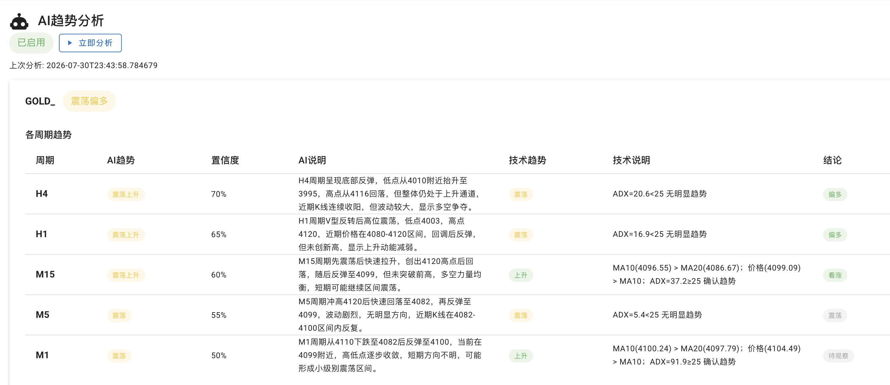
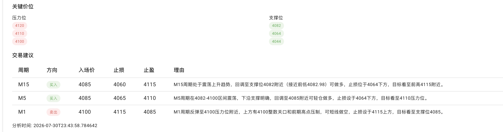
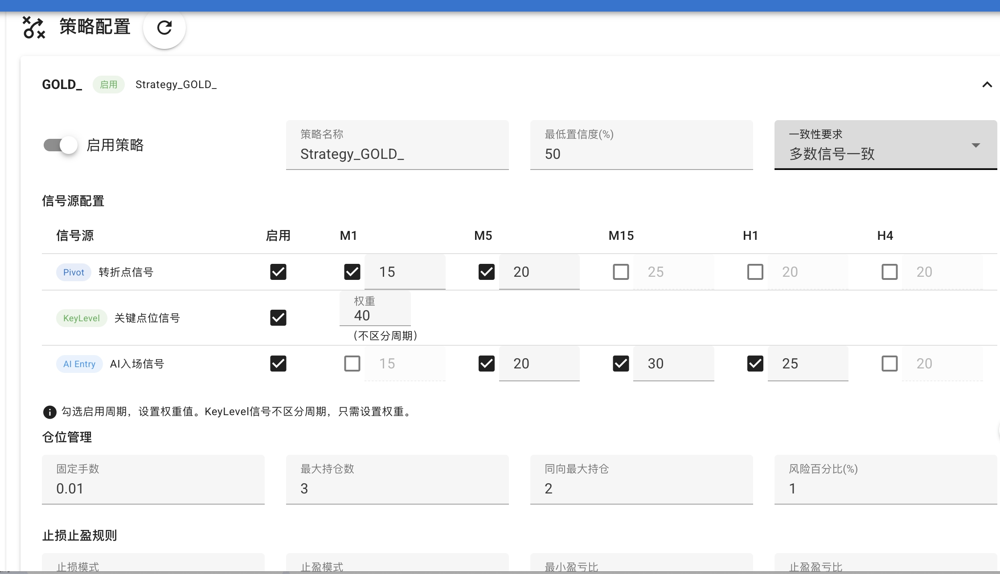
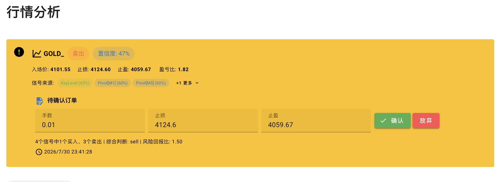
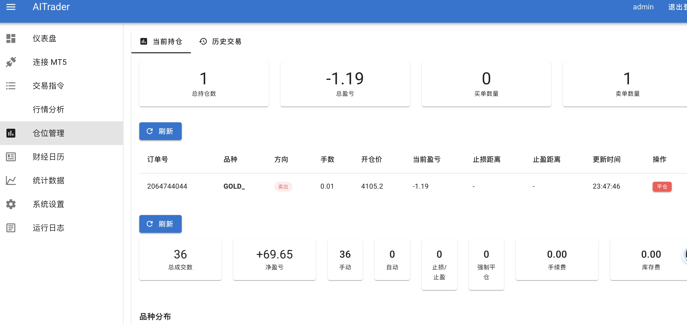
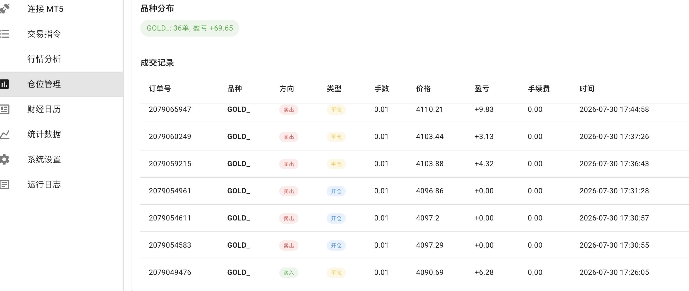
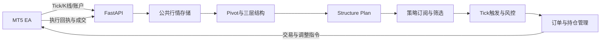

# AITrader

面向 MetaTrader 5 的多用户自动交易平台。系统将 MT5 行情、结构分析、交易计划、策略筛选、风险控制、持仓管理和订单执行拆分为独立模块，支持模拟盘与实盘运行。

> 本项目用于技术研究与策略验证，不构成投资建议。自动交易存在资金损失风险，请先在模拟账户中充分验证。


## 核心能力

- MT5 EA 上报 Tick、K 线、账户、持仓和成交，服务端返回订单、止损调整和分批平仓指令。
- K 线、Pivot、市场结构和公共交易计划按用户、品种、周期共享，不与模拟盘或实盘账户重复绑定。
- 三层市场结构：Internal、Swing、External。
- 识别趋势、箱体、收敛/扩散三角形、BOS、CHOCH 和流动性扫单。
- `STRUCTURE PLAN` 按品种、周期、Setup 独立配置，并支持公共默认值回退。
- 计划保存结构段、版本、阶段、价格来源、计算公式、失效规则和箱体边界交易周期。
- 策略订阅多个信号源，由策略、持仓管理和账户风控共同决定是否执行。
- 支持普通持仓管理与 `multi_level_exit` 多层止盈止损。
- 支持模拟盘、MT5 实盘、策略运行中心、完整审计链、AI 复盘和收益归因。

## 产品界面

### AI 行情分析与交易建议

系统按周期展示 AI 行情判断、趋势依据、关键价位以及入场、止损、止盈建议。





### 策略配置与账户执行

策略页面集中配置信号源、允许方向、风险约束和持仓管理；交易账户页面展示部署状态、账户资金和运行状态。




### 订单、持仓与交易统计

平台提供待执行订单、当前持仓、历史成交和策略收益统计，支持从策略决策追溯到 EA 执行回执。







## 系统链路



K 线收盘驱动结构分析与计划更新；Tick 负责判断入场区域和实时执行；EA `OnTimer` 负责账户、持仓、成交、心跳和补报任务。

## STRUCTURE PLAN

### 配置优先级

```text
品种 + 周期 + Setup
        ↓
品种 + 周期
        ↓
公共默认配置
```

配置入口：管理员后台 → 设置 → 结构分析。

配置内容包括入场区域、ATR 缓冲、最低真实盈亏比、突破位移、回踩确认、箱体边界确认、三角形提前布局和安全兜底 K 线数。

### 生命周期

```text
candidate   候选：结构存在，但尚未满足交易条件
confirmed   已确认：收盘突破、回收或反转条件成立
active      可交易：等待 Tick 进入入场区
triggered   已触发：已进入订单执行链路
invalidated 已失效：结构条件被破坏
superseded  已替代：被同一结构段的新版本替代
```

计划主要由结构事件管理，不使用短固定有效期。后台保留默认 100 根当前周期 K 线的安全上限，避免异常情况下计划永久存在。

常见失效事件：

- 箱体突破后重新回到箱体内部；
- 三角形反向突破或形态破坏；
- 趋势保护 HL/LH 被突破；
- 同一结构段生成新版本计划；
- 同一箱体边界周期已经触发。

### 价格来源

计划不会只保存价格，还会保存来源与计算方式：

```json
{
  "price_sources": {
    "entry": {"source": "HL/LH_or_trendline", "formula": "reference level / structure boundary"},
    "stop_loss": {"source": "protected_structure_level_atr_buffer", "formula": "reference level ± ATR buffer"},
    "take_profit": {"source": "next_structure_target", "formula": "structure target or measured move"}
  }
}
```

### 箱体边界周期

箱体边界计划持久化以下状态，避免同一边界连续重复开仓：

```text
unvisited → touched → triggered → left_boundary
```

同一 `boundary_cycle_id` 只能触发一次；价格离开边界区域并产生新的结构周期后，才允许新的同方向机会。

## 信号源与策略

平台支持 AI 行情/交易建议、Pivot、关键价位、整数点位和结构计划等信号源。信号源产生市场信号或公共计划，策略负责订阅、允许方向、账户执行和风险筛选。

结构计划执行顺序：

1. 新 K 线收盘后识别结构和事件；
2. 行情层生成候选计划并保存结构快照；
3. 收盘确认后进入 `confirmed`；
4. 满足回踩/回收条件后进入 `active`；
5. Tick 进入入场区后执行策略和风控检查；
6. 通过后按 exactly-once 规则消费并向 EA 下发指令。

同一计划、同一部署只能消费一次。相反方向计划会结合结构方向、确认质量、距离和盈亏比解决冲突。

## 持仓管理

- 初始灾难保护止损；
- 达到指定 R 后移动到保本；
- ATR、结构保护点或趋势线移动止损；
- 多目标分批止盈；
- `multi_level_exit` 接收多个止损和止盈层级；
- 所有调整均记录服务端事件、EA 指令和执行回执。

## 数据与存储

生产环境统一使用 MySQL，存储行情、Pivot、交易计划、策略决策、账户快照、持仓、成交、审计链和复盘结果。结构快照大对象可存本地文件，MySQL 记录路径与元数据。

实时 K 线默认保留 7 天，每天北京时间 02:00 清理。回测使用独立历史数据加载链路，不受实时数据保留周期限制。

## MT5 EA 接入

1. 在平台下载专属 EA；
2. 放入 `MQL5/Experts/AITrader/`；
3. 在 MT5 WebRequest 白名单加入后端地址；
4. 挂载 EA 并启用自动交易；
5. EA 首次通信后绑定用户与账户。

服务端最低 EA 版本为 `2.0.7`。实盘账户持续上报心跳和行情，品种离线超过 10 分钟时可发送提醒邮件。

## 技术栈

| 层级 | 技术 |
| --- | --- |
| 前端 | Vue 3、Vuetify、ECharts、Axios、Vite |
| 后端 | Python、FastAPI、Uvicorn、Pydantic |
| 数据库 | MySQL 8.x |
| 交易终端 | MetaTrader 5、MQL5 EA |
| AI | OpenAI-compatible API |
| 部署 | systemd、Nginx |

## 项目结构

```text
AI-Trader/
├── main.py                         FastAPI 入口
├── routes_*.py                     API 路由
├── trading_engine_manager.py       多账户交易引擎
├── market/
│   ├── models/                     领域模型
│   ├── services/                   结构、信号、策略、风控、LLM
│   └── store/                      MySQL 存储与计划执行记录
├── frontend/
│   ├── src/views/                  Vue 页面
│   ├── src/api/                    API 客户端
│   └── tests/                      前端测试
├── deploy/                         systemd、Nginx 和更新脚本
├── mt5TerminalEA.mq5               EA 源码
└── dist/mt5TerminalEA.ex5          已编译 EA
```

## 本地开发

要求：Python 3.9+、Node.js 18+、npm、MySQL 8.x。

```bash
git clone git@github.com:guaiwoluo2020/AI-Trader.git
cd AI-Trader
python3 -m venv venv
source venv/bin/activate
pip install -r requirements.txt
python3 main.py
```

前端：

```bash
cd frontend
npm install
npm run dev
```

后端默认地址为 `http://127.0.0.1:8000`，API 文档位于 `/docs`；前端开发服务默认地址为 `http://127.0.0.1:5173`。

## 测试与构建

```bash
python3 -m unittest discover -p "test_*.py"

cd frontend
node --test tests/*.test.mjs
npm run build
```

## 生产部署

生产环境由 systemd 管理后端，Nginx 托管 `frontend/dist` 并代理 `/api/`。

```bash
bash deploy/update-server.sh
systemctl is-active ai-trader
curl http://127.0.0.1:8000/health
```

## 路线图

- 完善计划质量评分和计划到成交的统计闭环；
- 增加结构段错切率、确认延迟和自动标注评估；
- 扩展按 Setup 的持仓管理模板与自适应参数；
- 增加 Docker 化、数据库迁移和备份工具；
- 扩展更多交易终端与行情源。

## 风险声明

AI、技术指标与结构规则都可能产生错误、延迟或不完整信号。历史回测和模拟盘结果不代表未来表现。连接实盘前，请确认账户、品种、时区、EA 版本、止损和每日风险限制均符合预期。
